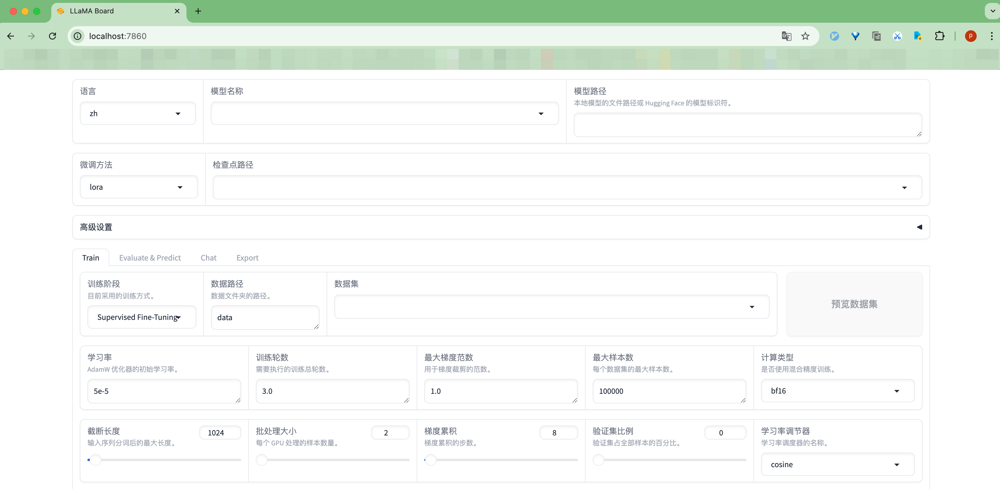
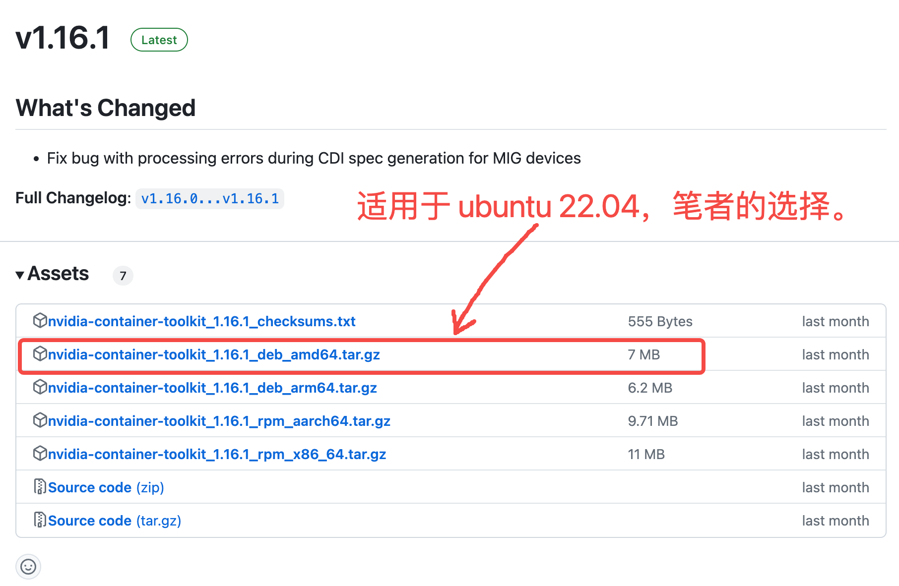

# 介绍以docker方式启动llamafactory(适用于CUDA用户)

本章介绍如何以docker方式启动llamafactory(适用于CUDA用户)。

- [介绍以docker方式启动llamafactory(适用于CUDA用户)](#介绍以docker方式启动llamafactory适用于cuda用户)
  - [前言(可选):](#前言可选)
    - [启动 Docker 服务:](#启动-docker-服务)
    - [将 Docker 添加到启动项，以确保在系统重新启动时 Docker 会自动启动：](#将-docker-添加到启动项以确保在系统重新启动时-docker-会自动启动)
  - [克隆LLaMA-Factory仓库:](#克隆llama-factory仓库)
  - [切换到docker-cuda目录](#切换到docker-cuda目录)
  - [拉取镜像并启动容器:](#拉取镜像并启动容器)
  - [查看容器信息(可选):](#查看容器信息可选)
  - [进入llamafactory容器操作:](#进入llamafactory容器操作)
  - [配置使用魔搭社区下载模型(可选):](#配置使用魔搭社区下载模型可选)
  - [启动 LLaMA Board 可视化微调（由 Gradio 驱动）:](#启动-llama-board-可视化微调由-gradio-驱动)
  - [数据卷详情(可选):](#数据卷详情可选)
  - [无法以Docker方式启动llamafactory解决方案(可选):](#无法以docker方式启动llamafactory解决方案可选)
    - [方法一: nvidia官方提供的安装方式:](#方法一-nvidia官方提供的安装方式)
      - [1. 配置代码仓库:](#1-配置代码仓库)
      - [2. 更新包列表:](#2-更新包列表)
      - [3. 安装NVIDIA Container Toolkit:](#3-安装nvidia-container-toolkit)
    - [方法二: 手动安装NVIDIA Container Toolkit:](#方法二-手动安装nvidia-container-toolkit)
      - [1. 下载安装包:](#1-下载安装包)
      - [2. 将安装包上传到服务器:](#2-将安装包上传到服务器)
      - [3. 解压文件:](#3-解压文件)
      - [4. 按依赖顺序安装 .deb 文件:](#4-按依赖顺序安装-deb-文件)
      - [5. 验证安装:](#5-验证安装)


## 前言(可选):

使用Docker部署LLaMA-Factory前先确定你的系统有Docker，如果还没有安装Docker，可以查看笔者的[Docker 安装教程](https://github.com/peilongchencc/docker_tutorial/tree/main/docker_install)。

Docker安装好后，记得先启动你的Docker再执行后续操作，不要Docker都没有启动，还问笔者为啥Docker部署失败‼️‼️

### 启动 Docker 服务:

如果你的Docker服务没有启动，可以运行以下指令启动Docker服务:<br>

```bash
sudo systemctl start docker
```

### 将 Docker 添加到启动项，以确保在系统重新启动时 Docker 会自动启动：

```bash
sudo systemctl enable docker
```

终端显示:<br>

```log
Synchronizing state of docker.service with SysV service script with /lib/systemd/systemd-sysv-install.
Executing: /lib/systemd/systemd-sysv-install enable docker
```


## 克隆LLaMA-Factory仓库:

```bash
git clone --depth 1 https://github.com/hiyouga/LLaMA-Factory.git
```


## 切换到docker-cuda目录

```bash
cd LLaMA-Factory/docker/docker-cuda/
```


## 拉取镜像并启动容器:

终端运行下列指令，拉取（如果本地不存在）镜像并启动容器:

> 后续启动如果你的镜像已经存在且最新，则会跳过拉取步骤，会直接启动容器。

```bash
docker compose up -d
```

> [!CAUTION]
> docker compose指令需要在有 `docker-compose.yml` 存在的目录执行。

🚨注意: LLaMA-Factory中适用CUDA用户的pytorch，镜像源来自NGC，压缩包大小为 4.84 GB，含有下列内容:

- CUDA
- cuBLAS
- NVIDIA cuDNN
- NVIDIA NCCL (optimized for NVLink)
- RAPIDS
- NVIDIA Data Loading Library (DALI)
- TensorRT
- Torch-TensorRT

由于含有的内容很大，所以拉取速度会很慢，需要多等待一会。

‼️如果卡在NGC的pytorch拉取失败，可以根据NGC的信息从Docker Hub或其他资源拉取。NGC的pytorch链接:

```log
https://catalog.ngc.nvidia.com/orgs/nvidia/containers/pytorch
```

‼️如果卡在 `pip install` 的位置报错了，可以将`docker-compose.yml`中的`PIP_INDEX`修改为国内pypi源。例如:

> 别担心pytorch会重新下载，pytorch镜像如果拉取成功了，重新运行`docker compose up -d`会直接从pip的地方开始运行。

```bash
services:
  llamafactory:
    build:
      dockerfile: ./docker/docker-cuda/Dockerfile
      context: ../..
      args:
        INSTALL_BNB: false
        INSTALL_VLLM: false
        INSTALL_DEEPSPEED: false
        INSTALL_FLASHATTN: false
        PIP_INDEX: https://mirrors.aliyun.com/pypi/simple
```

> 修改 `docker-compose.yml` 中的 `args` 会覆盖或扩充 `Dockerfile` 中的 `ARG` 参数。

> [!TIP]
> 终极方案: 如果各种方式尝试了都无法拉取，就找个能拉取下来镜像的人，让他把镜像压缩为tar发给你😎

终端示例:

```log
(base) root@ubuntu22:~/data/LLaMA-Factory/docker/docker-cuda# docker compose up -d
[+] Building 788.3s (12/12) FINISHED                                                                                                                                        docker:default
 => [llamafactory internal] load build definition from Dockerfile                                                                                                                     0.1s
 => => transferring dockerfile: 1.83kB                                                                                                                                                0.0s
 => [llamafactory internal] load metadata for nvcr.io/nvidia/pytorch:24.02-py3                                                                                                        3.6s
 => [llamafactory internal] load .dockerignore                                                                                                                                        0.0s
 => => transferring context: 147B                                                                                                                                                     0.0s
 => [llamafactory 1/7] FROM nvcr.io/nvidia/pytorch:24.02-py3@sha256:69c54ea51853c57b1f5abae7878a64b238fb10c177855e1c6521d7ab87fad2eb                                                660.1s
 => => resolve nvcr.io/nvidia/pytorch:24.02-py3@sha256:69c54ea51853c57b1f5abae7878a64b238fb10c177855e1c6521d7ab87fad2eb                                                               0.0s
 => [llamafactory internal] load build context                                                                                                                                        0.2s
 => => transferring context: 6.37MB                                                                                                                                                   0.1s
 => [llamafactory 2/7] WORKDIR /app                                                                                                                                                   3.9s
 => [llamafactory 3/7] COPY requirements.txt /app                                                                                                                                     0.1s
 => [llamafactory 4/7] RUN pip config set global.index-url "https://pypi.org/simple" &&     pip config set global.extra-index-url "https://pypi.org/simple" &&     python -m pip in  77.4s
 => [llamafactory 5/7] COPY . /app                                                                                                                                                    0.3s
 => [llamafactory 6/7] RUN EXTRA_PACKAGES="metrics";     if [ "false" == "true" ]; then         EXTRA_PACKAGES="${EXTRA_PACKAGES},bitsandbytes";     fi;     if [ "false" == "true"  19.4s
 => [llamafactory 7/7] RUN pip uninstall -y transformer-engine flash-attn &&     if [ "false" == "true" ]; then         pip uninstall -y ninja && pip install ninja &&         pip i  2.1s
 => [llamafactory] exporting to image                                                                                                                                                 3.4s
 => => exporting layers                                                                                                                                                               3.3s
 => => writing image sha256:269a73554cd54034aa4dd4dd034d90be0c6d4f26730814b5444f4ed4a406572b                                                                                          0.0s
 => => naming to docker.io/library/docker-cuda-llamafactory                                                                                                                           0.0s
[+] Running 2/2
 ✔ Network docker-cuda_default  Created                                                                                                                                               0.1s 
 ✔ Container llamafactory       Started                                                                                                                                               1.1s 
(base) root@ubuntu22:~/data/LLaMA-Factory/docker/docker-cuda# 
```


## 查看容器信息(可选):

终端运行下列指令查看本地Docker主机上可用的所有Docker镜像的列表:

```bash
docker images
```

终端显示:

```bash
(base) root@ubuntu22:~/data/LLaMA-Factory/docker/docker-cuda# docker images
REPOSITORY                                                              TAG                        IMAGE ID       CREATED          SIZE
docker-cuda-llamafactory                                                latest                     269a73554cd5   19 minutes ago   22.7GB
```

**"SIZE: 22.7GB"** ，LLaMA-Factory 依赖安装完后真大啊。这还是没下载大模型呢。🫠

终端运行下列指令显示当前运行中的Docker容器的列表:

```bash
docker ps
```

终端显示:

```log
(base) root@ubuntu22:~/data/LLaMA-Factory/docker/docker-cuda# docker ps
CONTAINER ID   IMAGE                                                                          COMMAND                   CREATED             STATUS             PORTS                                                                                                      NAMES
30a7aaa46cca   docker-cuda-llamafactory                                                       "/opt/nvidia/nvidia_…"   19 minutes ago      Up 19 minutes      0.0.0.0:7860->7860/tcp, :::7860->7860/tcp, 6006/tcp, 8888/tcp, 0.0.0.0:8000->8000/tcp, :::8000->8000/tcp   llamafactory
```

- **PORTS:** 
  - `0.0.0.0:7860->7860/tcp` (表示本地主机的7860端口映射到容器的7860端口)
  - `0.0.0.0:8000->8000/tcp` (表示本地主机的8000端口映射到容器的8000端口)
  - 另外还有6006/tcp和8888/tcp（未映射到外部主机）。


## 进入llamafactory容器操作:

终端运行下列指令，在已经运行的名为 llamafactory 的容器中启动一个新的 Bash shell:

```bash
docker compose exec llamafactory bash
```

> 注意: 上述指令需要在 `docker-compose.yml` 所在目录运行。

终端示例:

```bash
(base) root@ubuntu22:~/data/LLaMA-Factory/docker/docker-cuda# docker compose exec llamafactory bash
root@30a7aaa46cca:/app# pwd
/app
root@30a7aaa46cca:/app# ls -l
total 148
-rw-r--r--  1 root root  1378 Aug 21 05:49 CITATION.cff
-rw-r--r--  1 root root 11324 Aug 21 05:49 LICENSE
-rw-r--r--  1 root root    33 Aug 21 05:49 MANIFEST.in
-rw-r--r--  1 root root   242 Aug 21 05:49 Makefile
-rw-r--r--  1 root root 49429 Aug 21 05:49 README.md
-rw-r--r--  1 root root 49184 Aug 21 05:49 README_zh.md
drwxr-xr-x  2 root root    83 Aug 21 05:49 assets
drwxr-xr-x  6 root root  4096 Aug 21 05:49 data
drwxr-xr-x  5 root root    44 Aug 21 05:49 evaluation
drwxr-xr-x 10 root root   182 Aug 21 05:49 examples
drwxr-xr-x  2 root root     6 Aug 21 06:19 output
-rw-r--r--  1 root root   645 Aug 21 05:49 pyproject.toml
-rw-r--r--  1 root root   289 Aug 21 05:49 requirements.txt
drwxr-xr-x  2 root root  4096 Aug 21 05:49 scripts
-rw-r--r--  1 root root  3393 Aug 21 05:49 setup.py
drwxr-xr-x  1 root root    35 Aug 21 06:18 src
drwxr-xr-x  5 root root    43 Aug 21 05:49 tests
root@30a7aaa46cca:/app#
```

发现了吗？容器内部的构成和 `LLaMA-Factory` 项目中的代码是一样的，而且现在你已经安装好了所有依赖，接下来和其他教程的操作方式都是一致的。🌈


## 配置使用魔搭社区下载模型(可选):

> 笔者的服务器连接不到hugging_face，所以使用的魔搭。

```bash
# 终端临时启用从 ModelScope Hub 获取模型
export USE_MODELSCOPE_HUB=1
```

`LLaMA-Factory 0.8.4.dev0` 版本的依赖少了 `modelscope`，需要自己安装下，否则无法从 ModelScope Hub 获取模型:

```bash
# 安装或升级modelscope
pip install modelscope -U
```

## 启动 LLaMA Board 可视化微调（由 Gradio 驱动）:

以LLaMA Board为例演示，进一步说明Docker部署和其他方式并没有不同。🏖️

终端运行以下指令开启可视化界面:

```bash
llamafactory-cli webui
```

终端示例:

```log
root@30a7aaa46cca:/app# llamafactory-cli webui
Running on local URL:  http://0.0.0.0:7860

To create a public link, set `share=True` in `launch()`.
```

此时本地浏览器输入 `http://localhost:7860/` 即可打开界面，效果如下:



选择 **"Chat"** ，然后选择模型，点击 "加载模型" 测试下模型是否可以正常拉取:


以下是笔者截取的终端拉取模型的信息，可以看出一切使用都是正常的。🌈

```log
root@30a7aaa46cca:/app# llamafactory-cli webui
Running on local URL:  http://0.0.0.0:7860

To create a public link, set `share=True` in `launch()`.
tokenizer_config.json: 100%|██████████████████████████████████████████████████████████████████████████████████████████████████████████████████████████| 6.15k/6.15k [00:00<00:00, 21.1MB/s]
tokenization_chatglm.py: 100%|████████████████████████████████████████████████████████████████████████████████████████████████████████████████████████| 15.9k/15.9k [00:00<00:00, 58.5MB/s]
tokenizer.model: 100%|████████████████████████████████████████████████████████████████████████████████████████████████████████████████████████████████| 2.62M/2.62M [00:00<00:00, 20.1MB/s]
[INFO|tokenization_utils_base.py:2289] 2024-08-21 07:00:14,511 >> loading file tokenizer.model from cache at /root/.cache/huggingface/hub/models--THUDM--glm-4-9b-chat/snapshots/f6e0743b285dd808084530f070ad08e504386750/tokenizer.model
[INFO|tokenization_utils_base.py:2289] 2024-08-21 07:00:14,511 >> loading file added_tokens.json from cache at None
[INFO|tokenization_utils_base.py:2289] 2024-08-21 07:00:14,511 >> loading file special_tokens_map.json from cache at None
[INFO|tokenization_utils_base.py:2289] 2024-08-21 07:00:14,511 >> loading file tokenizer_config.json from cache at /root/.cache/huggingface/hub/models--THUDM--glm-4-9b-chat/snapshots/f6e0743b285dd808084530f070ad08e504386750/tokenizer_config.json
[INFO|tokenization_utils_base.py:2289] 2024-08-21 07:00:14,511 >> loading file tokenizer.json from cache at None
[INFO|tokenization_utils_base.py:2533] 2024-08-21 07:00:15,511 >> Special tokens have been added in the vocabulary, make sure the associated word embeddings are fine-tuned or trained.
08/21/2024 07:00:15 - INFO - llamafactory.data.template - Add <|user|>,<|observation|> to stop words.
config.json: 100%|████████████████████████████████████████████████████████████████████████████████████████████████████████████████████████████████████| 1.44k/1.44k [00:00<00:00, 9.54MB/s]
[INFO|configuration_utils.py:733] 2024-08-21 07:00:16,089 >> loading configuration file config.json from cache at /root/.cache/huggingface/hub/models--THUDM--glm-4-9b-chat/snapshots/f6e0743b285dd808084530f070ad08e504386750/config.json
configuration_chatglm.py: 100%|███████████████████████████████████████████████████████████████████████████████████████████████████████████████████████| 2.27k/2.27k [00:00<00:00, 9.28MB/s]
[INFO|configuration_utils.py:733] 2024-08-21 07:00:17,011 >> loading configuration file config.json from cache at /root/.cache/huggingface/hub/models--THUDM--glm-4-9b-chat/snapshots/f6e0743b285dd808084530f070ad08e504386750/config.json
[INFO|configuration_utils.py:800] 2024-08-21 07:00:17,012 >> Model config ChatGLMConfig {
  "_name_or_path": "THUDM/glm-4-9b-chat",
  "add_bias_linear": false,
  "add_qkv_bias": true,
  "apply_query_key_layer_scaling": true,
  "apply_residual_connection_post_layernorm": false,
  "architectures": [
    "ChatGLMModel"
  ],
  "attention_dropout": 0.0,
  "attention_softmax_in_fp32": true,
  "auto_map": {
    "AutoConfig": "THUDM/glm-4-9b-chat--configuration_chatglm.ChatGLMConfig",
    "AutoModel": "THUDM/glm-4-9b-chat--modeling_chatglm.ChatGLMForConditionalGeneration",
    "AutoModelForCausalLM": "THUDM/glm-4-9b-chat--modeling_chatglm.ChatGLMForConditionalGeneration",
    "AutoModelForSeq2SeqLM": "THUDM/glm-4-9b-chat--modeling_chatglm.ChatGLMForConditionalGeneration",
    "AutoModelForSequenceClassification": "THUDM/glm-4-9b-chat--modeling_chatglm.ChatGLMForSequenceClassification"
  },
  "bias_dropout_fusion": true,
  "classifier_dropout": null,
  "eos_token_id": [
    151329,
    151336,
    151338
  ],
  "ffn_hidden_size": 13696,
  "fp32_residual_connection": false,
  "hidden_dropout": 0.0,
  "hidden_size": 4096,
  "kv_channels": 128,
  "layernorm_epsilon": 1.5625e-07,
  "model_type": "chatglm",
  "multi_query_attention": true,
  "multi_query_group_num": 2,
  "num_attention_heads": 32,
  "num_hidden_layers": 40,
  "num_layers": 40,
  "original_rope": true,
  "pad_token_id": 151329,
  "padded_vocab_size": 151552,
  "post_layer_norm": true,
  "rmsnorm": true,
  "rope_ratio": 500,
  "seq_length": 131072,
  "tie_word_embeddings": false,
  "torch_dtype": "bfloat16",
  "transformers_version": "4.43.4",
  "use_cache": true,
  "vocab_size": 151552
}

08/21/2024 07:00:17 - INFO - llamafactory.model.patcher - Using KV cache for faster generation.
modeling_chatglm.py: 100%|████████████████████████████████████████████████████████████████████████████████████████████████████████████████████████████| 47.3k/47.3k [00:00<00:00, 73.2MB/s]
model.safetensors.index.json: 100%|███████████████████████████████████████████████████████████████████████████████████████████████████████████████████| 29.1k/29.1k [00:00<00:00, 49.7MB/s]
[INFO|modeling_utils.py:3644] 2024-08-21 07:00:18,803 >> loading weights file model.safetensors from cache at /root/.cache/huggingface/hub/models--THUDM--glm-4-9b-chat/snapshots/f6e0743b285dd808084530f070ad08e504386750/model.safetensors.index.json
Downloading shards:   0%|                                                                                                                                           | 0/10 [00:00<?, ?it/s]
model-00001-of-00010.safetensors:  92%|███████████████████████████████████████████████████████████████████████████████████████████████████████▏        | 1.79G/1.95G [03:27<04:07, 614kB/s]
```


## 数据卷详情(可选):

作为补充内容，这里介绍下Docker运行llamafactory后容器后，数据的存储位置:

- `hf_cache`：使用宿主机的 Hugging Face 缓存文件夹，允许更改为新的目录。

- `ms_cache`：类似 Hugging Face 缓存文件夹，为 ModelScope 用户提供。

- `data`：宿主机中存放数据集的文件夹路径。

- `output`：将导出目录设置为该路径后，即可在宿主机中访问导出后的模型。

如果你不了解数据卷的概念，建议查看笔者的[Docerfile 语法教程](https://github.com/peilongchencc/docker_tutorial/tree/main/dockerfile_command#docker-composeyml%E4%B8%AD%E7%9A%84volumes%E5%8F%AF%E9%80%89)。


## 无法以Docker方式启动llamafactory解决方案(可选):

如果你在以Docker方式部署llamafactory后，发现无法启动llamafactory容器，且错误如下:

> 笔者使用的 ubuntu 22.04

```log
(base) root@ubuntu22:~/data/LLaMA-Factory-main# cd docker/docker-cuda/
(base) root@ubuntu22:~/data/LLaMA-Factory-main/docker/docker-cuda# docker compose up -d
[+] Running 0/1
 ⠼ Container llamafactory  Starting                                                                                                                                                                                    0.5s 
Error response from daemon: could not select device driver "nvidia" with capabilities: [[gpu]]
(base) root@ubuntu22:~/data/LLaMA-Factory-main/docker/docker-cuda# docker ps
CONTAINER ID   IMAGE     COMMAND   CREATED   STATUS    PORTS     NAMES
(base) root@ubuntu22:~/data/LLaMA-Factory-main/docker/docker-cuda# docker images
```

这是因为你的服务器没有配置 **"显卡直通"** ，Docker容器无法使用GPU，需要安装 **"nvidia-container-toolkit"**。

可以从以下两种方法中任选其一，下载、安装 **"nvidia-container-toolkit"**:

### 方法一: nvidia官方提供的安装方式:

如果你的服务器能够正常从nvidia官方获取资源，那就非常方便了。按以下步骤操作即可:

> 详细信息可访问 "https://docs.nvidia.com/datacenter/cloud-native/container-toolkit/latest/install-guide.html#installing-the-nvidia-container-toolkit" 查看。

#### 1. 配置代码仓库:

```bash
curl -fsSL https://nvidia.github.io/libnvidia-container/gpgkey | sudo gpg --dearmor -o /usr/share/keyrings/nvidia-container-toolkit-keyring.gpg \
  && curl -s -L https://nvidia.github.io/libnvidia-container/stable/deb/nvidia-container-toolkit.list | \
    sed 's#deb https://#deb [signed-by=/usr/share/keyrings/nvidia-container-toolkit-keyring.gpg] https://#g' | \
    sudo tee /etc/apt/sources.list.d/nvidia-container-toolkit.list
```

#### 2. 更新包列表:

```bash
sudo apt update
```

#### 3. 安装NVIDIA Container Toolkit:

```bash
sudo apt-get install -y nvidia-container-toolkit
```

这就成功了～

### 方法二: 手动安装NVIDIA Container Toolkit:

如果你和笔者一样服务器网络受限，无法拉取类似 "https://nvidia.github.io" 的网址。那就需要手动下载 **NVIDIA Container Toolkit** 进行安装了。步骤如下:

#### 1. 下载安装包:

请根据以下网址访问NVIDIA Container Toolkit的GitHub，选择自己系统对应的安装包:

```log
https://github.com/NVIDIA/nvidia-container-toolkit/releases
```




#### 2. 将安装包上传到服务器:

根据个人习惯，使用 `scp` 或 vscode 界面拖拉上传文件到 **任意位置**。

#### 3. 解压文件:

如果你和笔者使用的相同的安装包，可以使用下列指令:

```bash
tar -xvf nvidia-container-toolkit_1.16.1_deb_amd64.tar.gz
```

解压后，效果如下:

```log
(base) root@ubuntu22:~/data# tar -xvf nvidia-container-toolkit_1.16.1_deb_amd64.tar.gz
release-v1.16.1-stable/packages/ubuntu18.04/amd64/libnvidia-container-dev_1.16.1-1_amd64.deb
release-v1.16.1-stable/packages/ubuntu18.04/amd64/libnvidia-container-tools_1.16.1-1_amd64.deb
release-v1.16.1-stable/packages/ubuntu18.04/amd64/libnvidia-container1-dbg_1.16.1-1_amd64.deb
release-v1.16.1-stable/packages/ubuntu18.04/amd64/libnvidia-container1_1.16.1-1_amd64.deb
release-v1.16.1-stable/packages/ubuntu18.04/amd64/nvidia-container-toolkit-base_1.16.1-1_amd64.deb
release-v1.16.1-stable/packages/ubuntu18.04/amd64/nvidia-container-toolkit-operator-extensions_1.16.1-1_amd64.deb
release-v1.16.1-stable/packages/ubuntu18.04/amd64/nvidia-container-toolkit_1.16.1-1_amd64.deb
(base) root@ubuntu22:~/data# 
```

#### 4. 按依赖顺序安装 .deb 文件:

```bash
sudo dpkg -i release-v1.16.1-stable/packages/ubuntu18.04/amd64/libnvidia-container1_1.16.1-1_amd64.deb \
release-v1.16.1-stable/packages/ubuntu18.04/amd64/libnvidia-container-tools_1.16.1-1_amd64.deb \
release-v1.16.1-stable/packages/ubuntu18.04/amd64/libnvidia-container-dev_1.16.1-1_amd64.deb \
release-v1.16.1-stable/packages/ubuntu18.04/amd64/nvidia-container-toolkit-base_1.16.1-1_amd64.deb \
release-v1.16.1-stable/packages/ubuntu18.04/amd64/nvidia-container-toolkit_1.16.1-1_amd64.deb
```

终端显示:

```log
(base) root@ubuntu22:~/data# sudo dpkg -i release-v1.16.1-stable/packages/ubuntu18.04/amd64/libnvidia-container1_1.16.1-1_amd64.deb \
release-v1.16.1-stable/packages/ubuntu18.04/amd64/libnvidia-container-tools_1.16.1-1_amd64.deb \
release-v1.16.1-stable/packages/ubuntu18.04/amd64/libnvidia-container-dev_1.16.1-1_amd64.deb \
release-v1.16.1-stable/packages/ubuntu18.04/amd64/nvidia-container-toolkit-base_1.16.1-1_amd64.deb \
release-v1.16.1-stable/packages/ubuntu18.04/amd64/nvidia-container-toolkit_1.16.1-1_amd64.deb
正在选中未选择的软件包 libnvidia-container1:amd64。
(正在读取数据库 ... 系统当前共安装有 218002 个文件和目录。)
准备解压 .../libnvidia-container1_1.16.1-1_amd64.deb  ...
正在解压 libnvidia-container1:amd64 (1.16.1-1) ...
正在选中未选择的软件包 libnvidia-container-tools。
准备解压 .../libnvidia-container-tools_1.16.1-1_amd64.deb  ...
正在解压 libnvidia-container-tools (1.16.1-1) ...
正在选中未选择的软件包 libnvidia-container-dev:amd64。
准备解压 .../libnvidia-container-dev_1.16.1-1_amd64.deb  ...
正在解压 libnvidia-container-dev:amd64 (1.16.1-1) ...
正在选中未选择的软件包 nvidia-container-toolkit-base。
准备解压 .../nvidia-container-toolkit-base_1.16.1-1_amd64.deb  ...
正在解压 nvidia-container-toolkit-base (1.16.1-1) ...
正在选中未选择的软件包 nvidia-container-toolkit。
准备解压 .../nvidia-container-toolkit_1.16.1-1_amd64.deb  ...
正在解压 nvidia-container-toolkit (1.16.1-1) ...
正在设置 libnvidia-container1:amd64 (1.16.1-1) ...
正在设置 libnvidia-container-tools (1.16.1-1) ...
正在设置 libnvidia-container-dev:amd64 (1.16.1-1) ...
正在设置 nvidia-container-toolkit-base (1.16.1-1) ...
正在设置 nvidia-container-toolkit (1.16.1-1) ...
正在处理用于 libc-bin (2.35-0ubuntu3.1) 的触发器 ...
(base) root@ubuntu22:~/data#
```

#### 5. 验证安装:

安装完成后，可以通过以下命令验证 NVIDIA Container Toolkit 是否正确安装：

```bash
nvidia-container-cli --version
```

终端显示:

```log
(base) root@ubuntu22:~/data# nvidia-container-cli --version
cli-version: 1.16.1
lib-version: 1.16.1
build date: 2024-07-23T14:57+00:00
build revision: 4c2494f16573b585788a42e9c7bee76ecd48c73d
build compiler: x86_64-linux-gnu-gcc-7 7.5.0
build platform: x86_64
build flags: -D_GNU_SOURCE -D_FORTIFY_SOURCE=2 -DNDEBUG -std=gnu11 -O2 -g -fdata-sections -ffunction-sections -fplan9-extensions -fstack-protector -fno-strict-aliasing -fvisibility=hidden -Wall -Wextra -Wcast-align -Wpointer-arith -Wmissing-prototypes -Wnonnull -Wwrite-strings -Wlogical-op -Wformat=2 -Wmissing-format-attribute -Winit-self -Wshadow -Wstrict-prototypes -Wunreachable-code -Wconversion -Wsign-conversion -Wno-unknown-warning-option -Wno-format-extra-args -Wno-gnu-alignof-expression -Wl,-zrelro -Wl,-znow -Wl,-zdefs -Wl,--gc-sections
(base) root@ubuntu22:~/data# 
```

现在，你已经成功安装了 NVIDIA Container Toolkit 1.16.1，并正确配置了环境。根据 `nvidia-container-cli --version` 的输出，工具包已经正确安装并可以正常使用。