# 在服务器使用自定义数据集训练模型

本章介绍如何在服务器使用自定义数据集(Alpaca格式)训练模型。如果你不清楚Alpaca格式，点击这里[查看教程](../data_structure/README.md)。

- [在服务器使用自定义数据集训练模型](#在服务器使用自定义数据集训练模型)
  - [1. 环境配置、依赖项安装:](#1-环境配置依赖项安装)
  - [2. 查看服务器显卡配置(可选):](#2-查看服务器显卡配置可选)
  - [3. 更新模型自我认知数据集(可选):](#3-更新模型自我认知数据集可选)
  - [4. 准备自定义数据集:](#4-准备自定义数据集)
  - [5. 将数据集放到LLaMA-Factory/data目录下:](#5-将数据集放到llama-factorydata目录下)
  - [6. 修改dataset\_info.json文件:](#6-修改dataset_infojson文件)
  - [7. 启动 LLaMA Board 可视化微调（由 Gradio 驱动）:](#7-启动-llama-board-可视化微调由-gradio-驱动)
  - [8. 参数、数据集设置:](#8-参数数据集设置)
  - [9. 训练模型:](#9-训练模型)
  - [10. 模型评估:](#10-模型评估)
  - [11. 新模型测试:](#11-新模型测试)
  - [12. 模型导出:](#12-模型导出)
  - [13. 项目内嵌、模型推理:](#13-项目内嵌模型推理)


## 1. 环境配置、依赖项安装:

创建、激活虚拟环境:

```bash
conda create --name llama_factory python=3.11
conda activate llama_factory
```

克隆 LLaMA-Factory 仓库，安装依赖项(很耗时):

```bash
git clone --depth 1 https://github.com/hiyouga/LLaMA-Factory.git
cd LLaMA-Factory
pip install -e ".[torch,metrics]"
```

配置使用魔搭社区下载模型:

> 笔者的服务器连接不到hugging_face，所以使用的魔搭。

```bash
# 终端临时启用从 ModelScope Hub 获取模型
export USE_MODELSCOPE_HUB=1
```

```bash
# 安装或升级modelscope
pip install modelscope -U
```


## 2. 查看服务器显卡配置(可选):

终端运行下列指令查看服务器的显卡配置，决定自己一会选择什么模型，单卡/多卡训练:

```bash
nvidia-smi
```

以笔者使用的 A100 40G 为例，终端将显示类似以下内容:

```log
Wed Aug 14 15:17:32 2024       
+---------------------------------------------------------------------------------------+
| NVIDIA-SMI 535.113.01             Driver Version: 535.113.01   CUDA Version: 12.2     |
|-----------------------------------------+----------------------+----------------------+
| GPU  Name                 Persistence-M | Bus-Id        Disp.A | Volatile Uncorr. ECC |
| Fan  Temp   Perf          Pwr:Usage/Cap |         Memory-Usage | GPU-Util  Compute M. |
|                                         |                      |               MIG M. |
|=========================================+======================+======================|
|   0  NVIDIA A100-PCIE-40GB          Off | 00000000:00:08.0 Off |                    0 |
| N/A   28C    P0              32W / 250W |      7MiB / 40960MiB |      0%      Default |
|                                         |                      |             Disabled |
+-----------------------------------------+----------------------+----------------------+
                                                                                         
+---------------------------------------------------------------------------------------+
| Processes:                                                                            |
|  GPU   GI   CI        PID   Type   Process name                            GPU Memory |
|        ID   ID                                                             Usage      |
|=======================================================================================|
|  No running processes found                                                           |
+---------------------------------------------------------------------------------------+
```


## 3. 更新模型自我认知数据集(可选):

如果你是Linux用户，可以运行下列指令，通过Linux自带的文本处理的工具(sed)，从终端直接更新模型自我认知数据集(identity.json)。

> 注意修改 "My-Llama-Chinese" 为你想要的模型名称，修改 "peilongchencc" 为作者名称。

```bash
sed -i 's/{{name}}/My-Llama-Chinese/g'  data/identity.json 
sed -i 's/{{author}}/peilongchencc/g'  data/identity.json 
```

你也可以选择在根目录创建一个文件(假设文件名为 `update_self_awareness.py`)，然后写入下列代码运行(`python update_self_awareness.py`):

```python
import json

# NAME = "Llama-Chinese"  # 定义常量NAME，表示模型名称
# AUTHOR = "LLaMA Factory"  # 定义常量AUTHOR，表示作者名称

NAME = "My-Llama-Chinese"  # 定义常量NAME，表示模型名称
AUTHOR = "peilongchencc"  # 定义常量AUTHOR，表示作者名称

# 打开并读取data/identity.json文件，文件编码为utf-8
with open("data/identity.json", "r", encoding="utf-8") as f:
  dataset = json.load(f)  # 将文件内容加载为JSON对象

# 遍历JSON对象中的每个样本
for sample in dataset:
  # 替换样本中的占位符{{name}}和{{author}}为实际的NAME和AUTHOR值
  sample["output"] = sample["output"].replace("{{"+ "name" + "}}", NAME).replace("{{"+ "author" + "}}", AUTHOR)

# 将修改后的数据重新写回data/identity.json文件，确保文件格式美观且不转义非ASCII字符
with open("data/identity.json", "w", encoding="utf-8") as f:
  json.dump(dataset, f, indent=2, ensure_ascii=False)
```


## 4. 准备自定义数据集:

数据集可参考当前项目文件的data模块:

[训练集-nurse_patient_data_train.json](..data/nurse_patient_data_train.json)

[测试集-nurse_patient_data_test.json](..data/nurse_patient_data_test.json)

> [!CAUTION]
> llama-factory需要自己划分数据集，"split" 参数是用来定位 HF 或 魔搭 中已划分好的数据集的。

例如llama-factory中 `data/dataset_info.json` 的下列内容:

```json
{
  "adgen_train": {
    "hf_hub_url": "HasturOfficial/adgen",
    "ms_hub_url": "AI-ModelScope/adgen",
    "split": "train",
    "columns": {
      "prompt": "content",
      "response": "summary"
    }
  },
  "adgen_eval": {
    "hf_hub_url": "HasturOfficial/adgen",
    "ms_hub_url": "AI-ModelScope/adgen",
    "split": "validation",
    "columns": {
      "prompt": "content",
      "response": "summary"
    }
  }
}
```

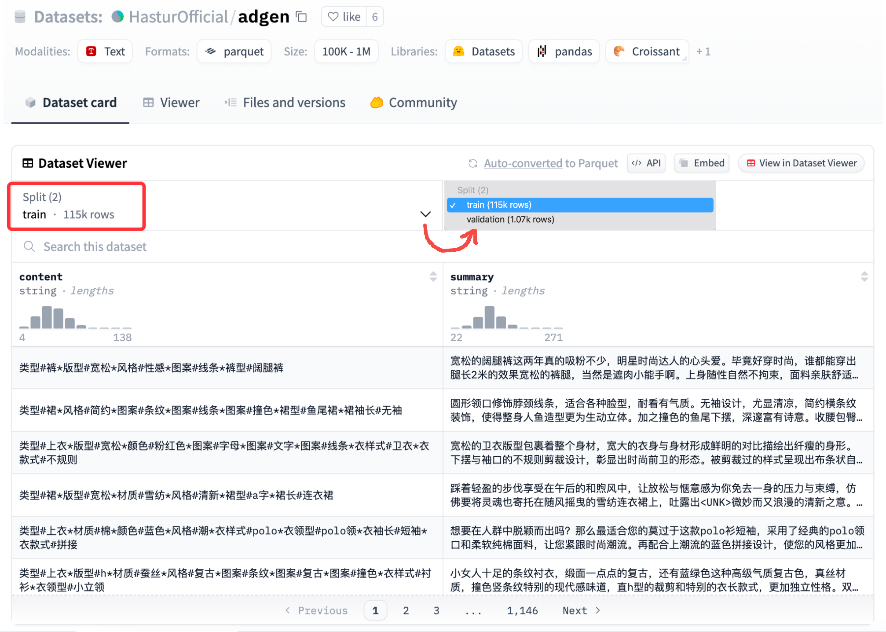


## 5. 将数据集放到LLaMA-Factory/data目录下:

只有将数据集放到 `LLaMA-Factory/data` 目录下，项目才能检索到。例如笔者使用的数据最终路径为:

```log
LLaMA-Factory/data/nurse_patient_data_train.json
LLaMA-Factory/data/nurse_patient_data_test.json
```


## 6. 修改dataset_info.json文件:

`dataset_info.json` 包含了项目所有可用的数据集，如果想要使用自定义数据集，必须在 `dataset_info.json` 添加自己的数据集描述。

`dataset_info.json` 文件位置为:

```log
LLaMA-Factory/data/dataset_info.json
```

以笔者使用的数据为例，修改方式如下:

```json
{
  "identity": {
    "file_name": "identity.json"
  },
  "nurse_patient_data_train": {
    "file_name": "nurse_patient_data_train.json"  // 这里!关注这里!
  },
  "nurse_patient_data_test": {
    "file_name": "nurse_patient_data_test.json"  // 这里!关注这里!
  },
  "alpaca_en_demo": {
    "file_name": "alpaca_en_demo.json"
  },
  "alpaca_zh_demo": {
    "file_name": "alpaca_zh_demo.json"
  }
}
```


## 7. 启动 LLaMA Board 可视化微调（由 Gradio 驱动）:

终端运行以下指令开启可视化界面:

> 启动的链接 http://localhost:7860/ 为转发端口，与服务器提供的外网端口无关。

```bash
llamafactory-cli webui
```

指令运行后稍作等待将自动弹出可视化界面，选择 **"Chat"** ，然后选择模型，点击 "加载模型" 测试下模型是否可以正常拉取:

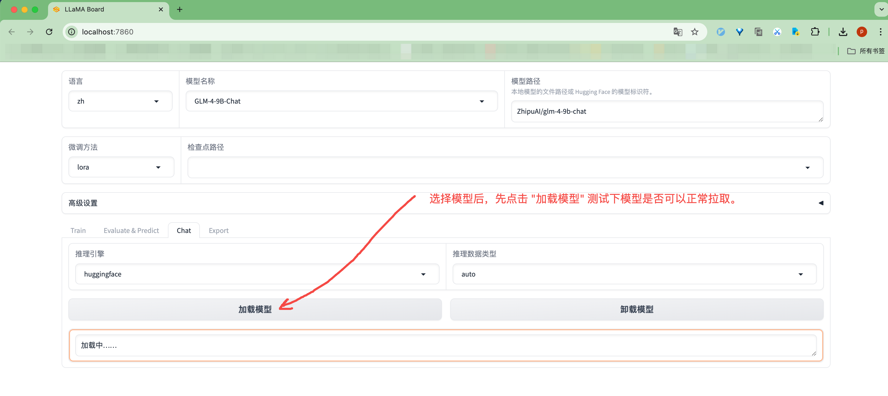

终端将显示模型拉取进度:

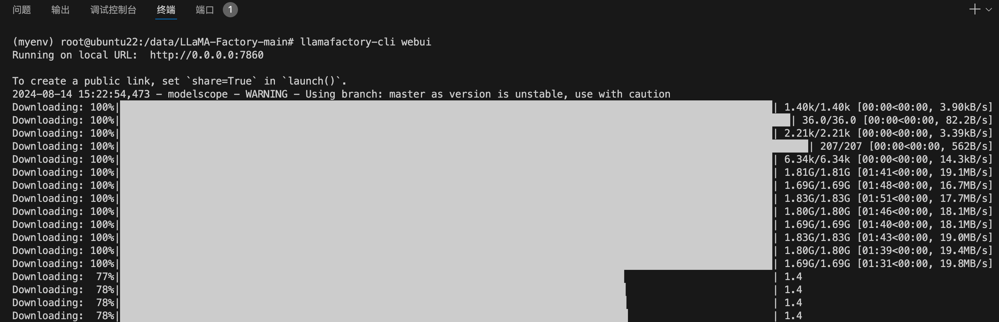

拉取的模型会存储在 `/root/.cache/` 目录下，例如笔者从modelscope拉取 `glm-4-9b-chat` 模型，则模型存储路径为:

```log
/root/.cache/modelscope/hub/ZhipuAI/glm-4-9b-chat
```

拉取成功后可以测试下是否可以正常聊天:

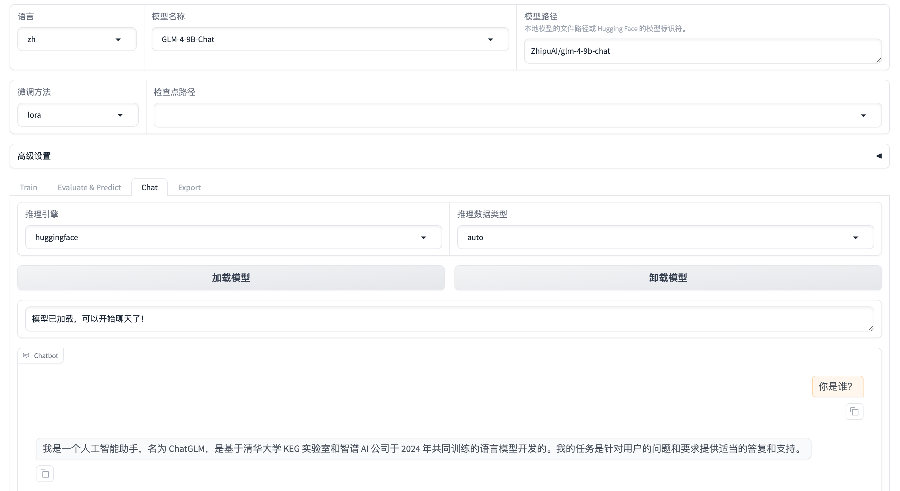


## 8. 参数、数据集设置:

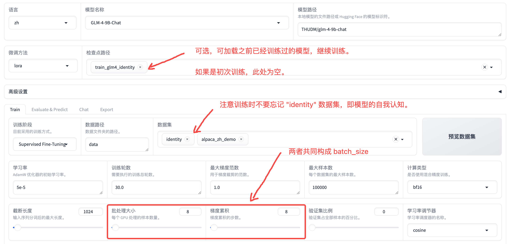


## 9. 训练模型:

点击开始，系统会自动下载模型。当显示进度条，loss逐渐变化时，模型即开始训练，效果如下图:

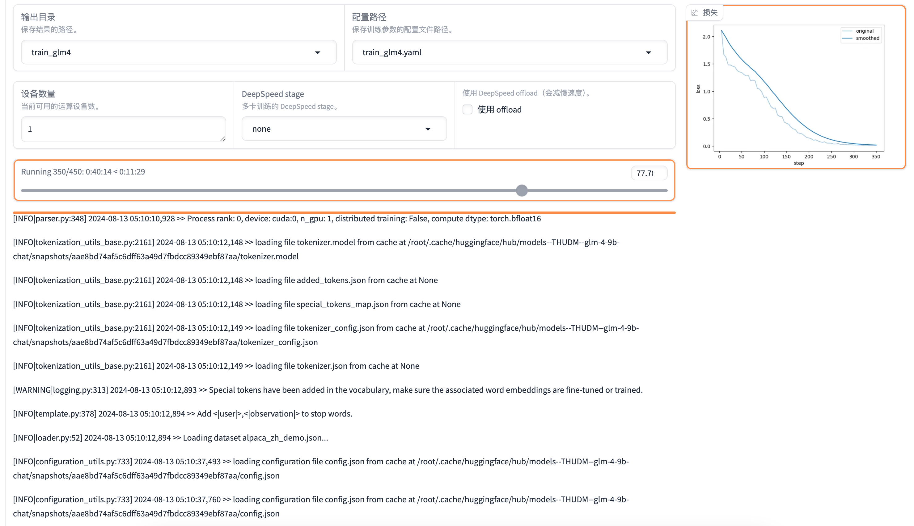

如果Loss没有收敛或降低到1以下，可以选择继续训练模型。


## 10. 模型评估:

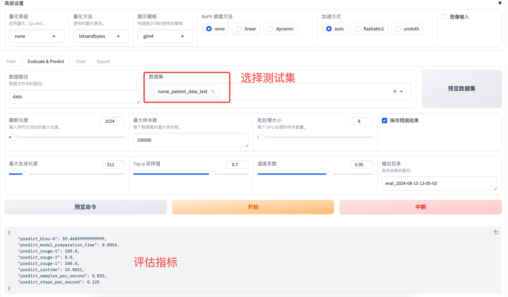


## 11. 新模型测试:

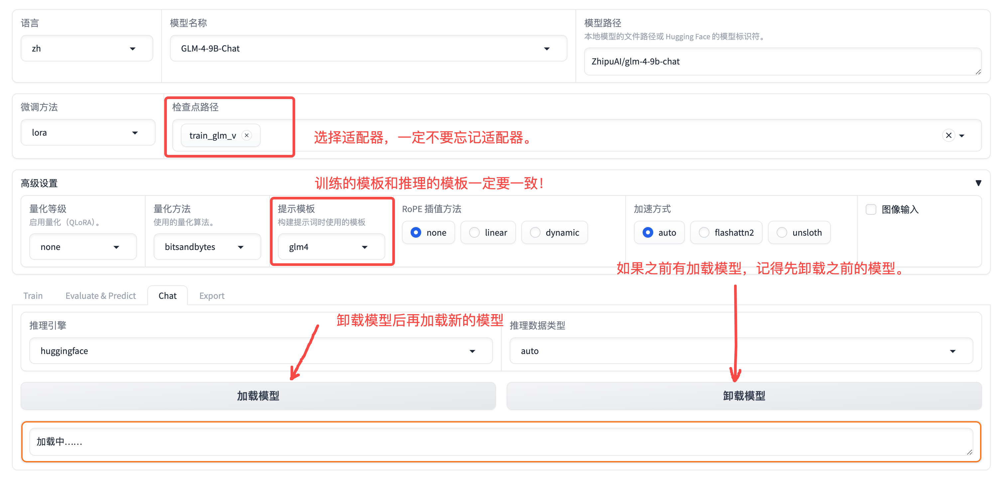

输入内容测试下效果:

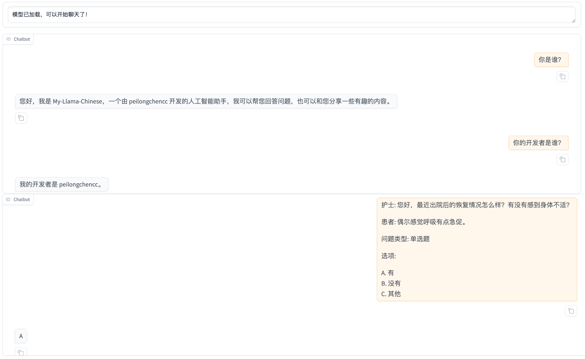


## 12. 模型导出:

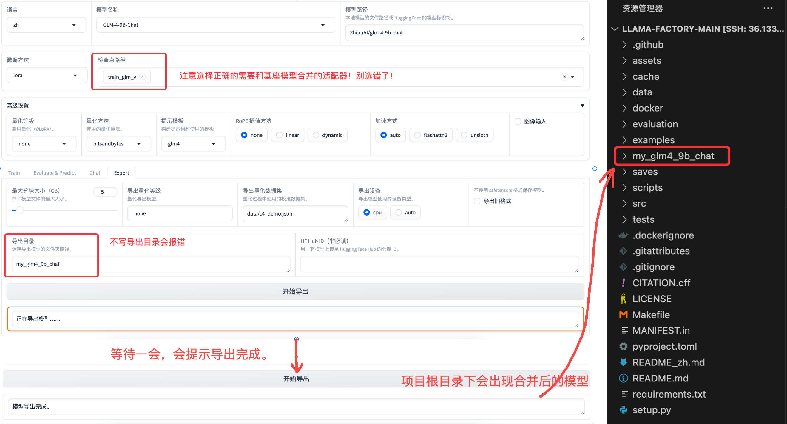


## 13. 项目内嵌、模型推理:

模型导出后，很多时候我们需要在自己的项目中运行模型进行推理，而不是将 llama-factory 的代码整个嵌入自己的项目。

以笔者使用的 `glm-4-9b-chat` 模型为例，我们需要去模型对应的官网找到推理代码，然后进行调用。例如:

使用 transformers 后端以命令行进行 `glm-4-9b-chat` 模型推理(流式输出):

[glm4_stream_cli_demo.py](../utils/glm4_stream_cli_demo.py)

GLM4官网代码链接:

```log
https://github.com/THUDM/GLM-4/blob/main/basic_demo/trans_cli_demo.py
```

使用 transformers 后端以web界面(Gradio驱动)进行 `glm-4-9b-chat` 模型推理(流式输出):

[glm4_stream_web_demo.py](../utils/glm4_stream_web_demo.py)

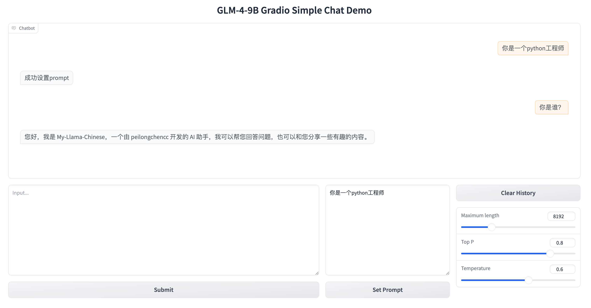

GLM4官网代码链接:

```log
https://github.com/THUDM/GLM-4/blob/main/basic_demo/trans_web_demo.py
```

注意⚠️: 运行上述代码时，记得将模型路径修改为你自己的路径。