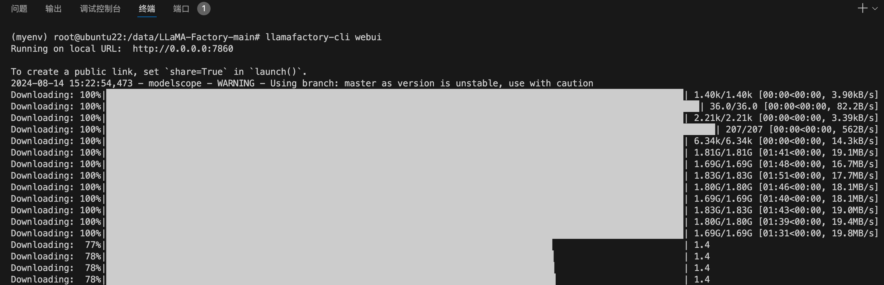

# 在服务器使用自定义数据集训练模型

## 环境配置、依赖项安装:

创建、激活虚拟环境:

```bash
conda create --name llama_factory python=3.11
conda activate llama_factory
```

克隆 LLaMA-Factory 仓库，安装依赖项(很耗时):

```bash
git clone --depth 1 https://github.com/hiyouga/LLaMA-Factory.git
cd LLaMA-Factory
pip install -e ".[torch,metrics]"
```

配置使用魔搭社区下载模型:

> 笔者的服务器连接不到hugging_face，所以使用的魔搭。

```bash
export USE_MODELSCOPE_HUB=1
pip install modelscope -U
```


## 查看服务器显卡配置(可选):

终端运行下列指令查看服务器的显卡配置，决定自己一会选择什么模型，单卡/多卡训练:

```bash
nvidia-smi
```

以笔者使用的 A100 40G 为例，终端将显示类似以下内容:

```log
Wed Aug 14 15:17:32 2024       
+---------------------------------------------------------------------------------------+
| NVIDIA-SMI 535.113.01             Driver Version: 535.113.01   CUDA Version: 12.2     |
|-----------------------------------------+----------------------+----------------------+
| GPU  Name                 Persistence-M | Bus-Id        Disp.A | Volatile Uncorr. ECC |
| Fan  Temp   Perf          Pwr:Usage/Cap |         Memory-Usage | GPU-Util  Compute M. |
|                                         |                      |               MIG M. |
|=========================================+======================+======================|
|   0  NVIDIA A100-PCIE-40GB          Off | 00000000:00:08.0 Off |                    0 |
| N/A   28C    P0              32W / 250W |      7MiB / 40960MiB |      0%      Default |
|                                         |                      |             Disabled |
+-----------------------------------------+----------------------+----------------------+
                                                                                         
+---------------------------------------------------------------------------------------+
| Processes:                                                                            |
|  GPU   GI   CI        PID   Type   Process name                            GPU Memory |
|        ID   ID                                                             Usage      |
|=======================================================================================|
|  No running processes found                                                           |
+---------------------------------------------------------------------------------------+
```


## 更新模型自我认知数据集(可选):

如果你是Linux用户，可以运行下列指令，通过Linux自带的文本处理的工具(sed)，从终端直接更新模型自我认知数据集(identity.json)。

> 注意修改 "PonyBot" 为你想要的模型名称，修改 "LLaMA Factory" 为作者名称。

```bash
sed -i 's/{{name}}/PonyBot/g'  data/identity.json 
sed -i 's/{{author}}/LLaMA Factory/g'  data/identity.json 
```

你也可以选择在根目录创建一个文件(假设文件名为 `update_self_awareness.py`)，然后写入下列代码运行(`python update_self_awareness.py`):

```python
import json

# NAME = "Llama-Chinese"  # 定义常量NAME，表示模型名称
# AUTHOR = "LLaMA Factory"  # 定义常量AUTHOR，表示作者名称

NAME = "My-Llama-Chinese"  # 定义常量NAME，表示模型名称
AUTHOR = "peilongchencc"  # 定义常量AUTHOR，表示作者名称

# 打开并读取data/identity.json文件，文件编码为utf-8
with open("data/identity.json", "r", encoding="utf-8") as f:
  dataset = json.load(f)  # 将文件内容加载为JSON对象

# 遍历JSON对象中的每个样本
for sample in dataset:
  # 替换样本中的占位符{{name}}和{{author}}为实际的NAME和AUTHOR值
  sample["output"] = sample["output"].replace("{{"+ "name" + "}}", NAME).replace("{{"+ "author" + "}}", AUTHOR)

# 将修改后的数据重新写回data/identity.json文件，确保文件格式美观且不转义非ASCII字符
with open("data/identity.json", "w", encoding="utf-8") as f:
  json.dump(dataset, f, indent=2, ensure_ascii=False)
```


## LLaMA Board 可视化微调（由 Gradio 驱动）:

终端运行以下指令开启可视化界面:

> 启动的链接 http://localhost:7860/ 为转发端口，与服务器提供的外网端口无关。

```bash
llamafactory-cli webui
```

指令运行后稍作等待将自动弹出可视化界面，然后选择模型，点击 "加载模型" 测试下模型是否可以正常拉取:


终端将显示模型拉取进度:

