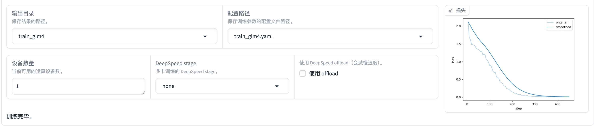
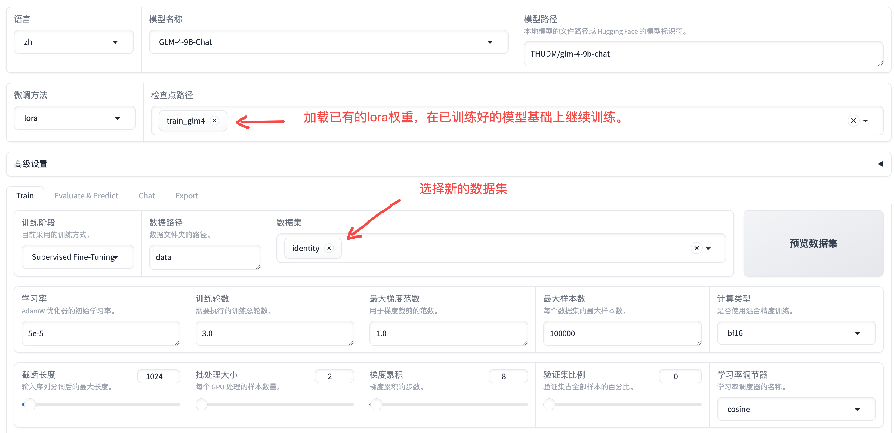
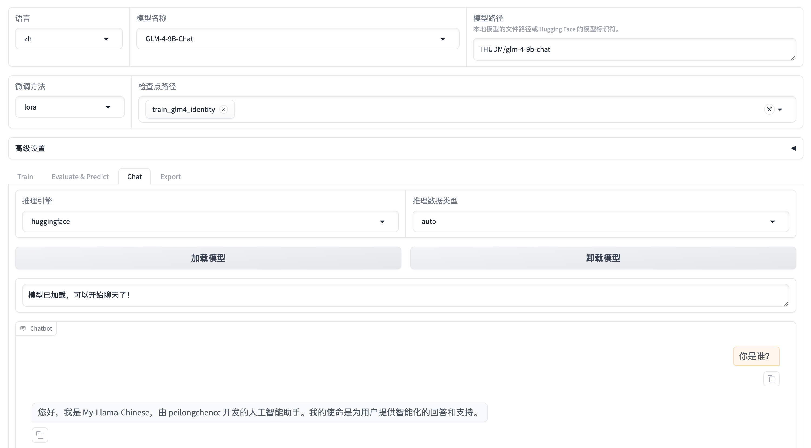
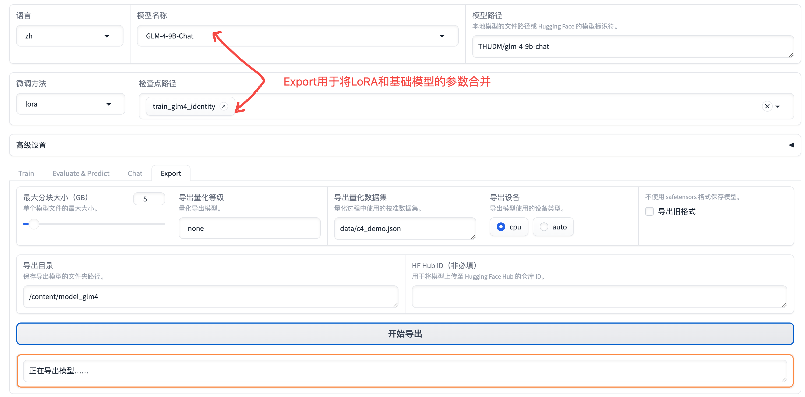
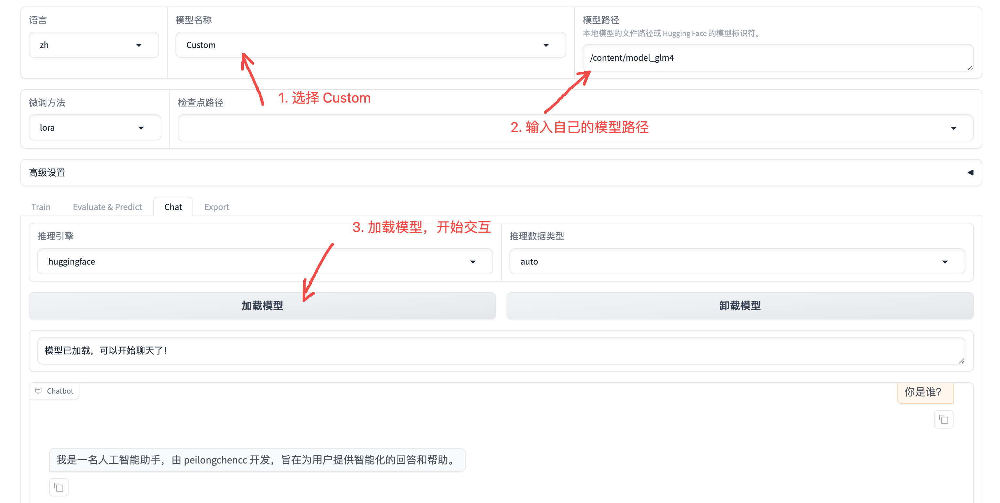

# 在Colab中使用项目本身数据集训练模型

本章通过在Colab中使用项目本身数据集训练模型，介绍LLaMA-Factory的使用。

- [在Colab中使用项目本身数据集训练模型](#在colab中使用项目本身数据集训练模型)
  - [前情提要:](#前情提要)
  - [模型训练](#模型训练)
    - [参数、数据集设置:](#参数数据集设置)
    - [开始训练:](#开始训练)
    - [模型保存路径:](#模型保存路径)
    - [模型训练结束:](#模型训练结束)
    - [模型的继续训练(可选):](#模型的继续训练可选)
  - [模型交互测试:](#模型交互测试)
  - [模型导出:](#模型导出)
  - [加载合并后的模型测试:](#加载合并后的模型测试)
  - [附录: Steps计算方式](#附录-steps计算方式)

## 前情提要:

笔者选择的模型为 GLM-4-9B-Chat，显卡为 A100 40G(单卡)。


## 模型训练

### 参数、数据集设置:


### 开始训练:

点击开始，系统会自动下载模型。当显示进度条，loss逐渐变化时，模型即开始训练，效果如下图:


### 模型保存路径:

在Colab中模型分阶段保存时显示的内容类似如下方式(笔者使用的 GLM-4-9B-Chat):

```log
[INFO|trainer.py:3478] 2024-08-13 05:24:45,906 >> Saving model checkpoint to saves/GLM-4-9B-Chat/lora/train_glm4/checkpoint-100
```

完整路径为:

```log
/content/LLaMA-Factory/saves/GLM-4-9B-Chat/lora/train_glm4/checkpoint-100
```

### 模型训练结束:

模型训练结束后会显示以下界面:



### 模型的继续训练(可选):

笔者训练时，第一次忘记加 "模型自我认知" 数据集了，然后继续训练了一下模型:



> [!TIP]
> 你可以选择先用小数据集训练模型，如果效果好再用大数据集训练模型，避免直接上大数据，测试的时间成本太高。


## 模型交互测试:




## 模型导出:



Colab界面显示的内容为:

```log
[INFO|configuration_utils.py:472] 2024-08-13 07:26:04,660 >> Configuration saved in /content/model_glm4/config.json
[INFO|configuration_utils.py:769] 2024-08-13 07:26:04,660 >> Configuration saved in /content/model_glm4/generation_config.json
[INFO|modeling_utils.py:2698] 2024-08-13 07:27:01,945 >> The model is bigger than the maximum size per checkpoint (5GB) and is going to be split in 4 checkpoint shards. You can find where each parameters has been saved in the index located at /content/model_glm4/model.safetensors.index.json.
[INFO|tokenization_utils_base.py:2574] 2024-08-13 07:27:01,948 >> tokenizer config file saved in /content/model_glm4/tokenizer_config.json
[INFO|tokenization_utils_base.py:2583] 2024-08-13 07:27:01,948 >> Special tokens file saved in /content/model_glm4/special_tokens_map.json
[INFO|tokenization_utils_base.py:2634] 2024-08-13 07:27:01,948 >> added tokens file saved in /content/model_glm4/added_tokens.json
```


## 加载合并后的模型测试:




## 附录: Steps计算方式

假设你使用的数据集为 alpaca_zh_demo ，则样本数: 1000

训练轮数: 30

每个设备上的即时批处理大小: 8

梯度累积: 8 (模型会在 8 个小批次（每个设备 8 个样本）上累积梯度，然后进行一次反向传播和参数更新。)

总的训练批处理大小(多GPU、梯度累积): 8x8=64

**Steps:**

(1000/64) = 15.625 --约等于--> 15

15 x 30 = 450

这就是你看到的模型训练阶段，进度条中的 Steps 的结果。