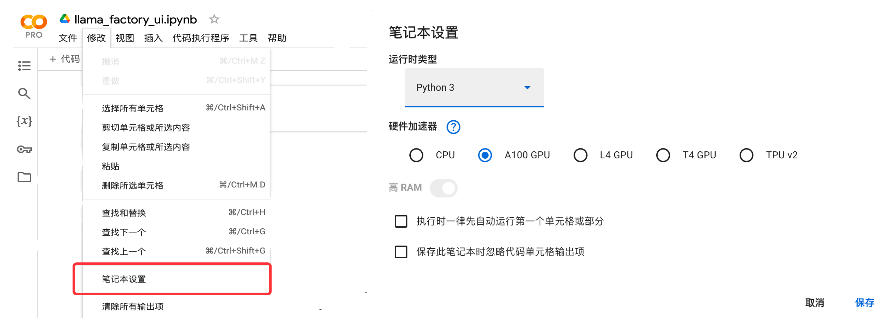
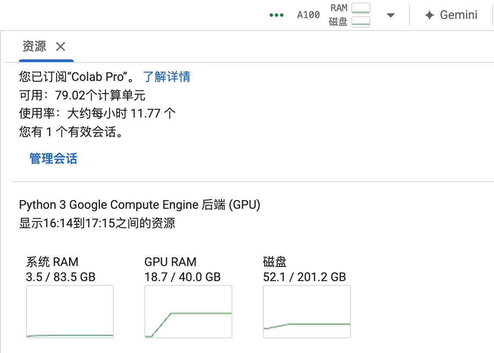
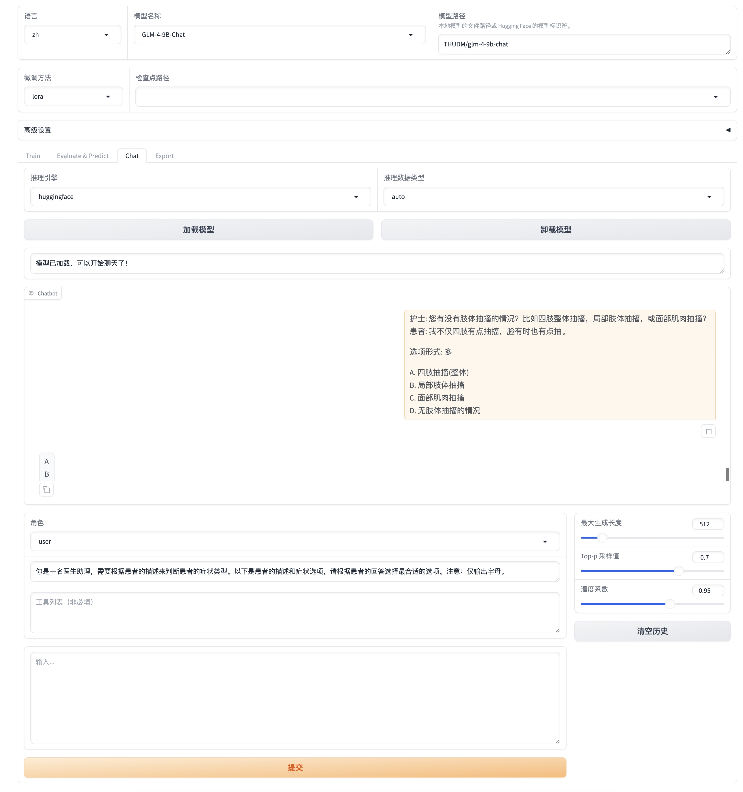

# Colab使用LLaMA-Factory加载模型

在Colab中使用LLaMA-Factory加载 `GLM-4-9B-Chat` ，介绍LLaMA-Factory的简单使用。<br>
- [Colab使用LLaMA-Factory加载模型](#colab使用llama-factory加载模型)
  - [程序启动前的注意事项:](#程序启动前的注意事项)
    - [1. GPU选择](#1-gpu选择)
    - [2. HF账号创建Token，获取模型拉取权限](#2-hf账号创建token获取模型拉取权限)
  - [程序启动:](#程序启动)
  - [测试模型:](#测试模型)
  - [Tips:](#tips)
  - [附录:](#附录)
    - [Colab如何如何登陆HF:](#colab如何如何登陆hf)


## 程序启动前的注意事项:

### 1. GPU选择

首先需要选择足够大的GPU显存才可以运行模型，Colab中GPU的选择方式为: **菜单栏 --> 修改 --> 笔记本设置** 。笔者选择的是GPU为 A100，图示如下:<br>



A100 运行 `GLM-4-9B-Chat` 时的资源占用为:<br>



> [!CAUTION]
> 使用T4显存会不够，高RAM也不行，所以尽可能使用A100。

### 2. HF账号创建Token，获取模型拉取权限

程序启动后，需要从 Hugging Face 拉取模型，所以需要登陆 HF 账号。且要保证自己拥有对应模型的拉取权限，例如 LLama 需要自己提前申请权限才能拉取。<br>


## 程序启动:

依次运行当前文件夹下 `llama_factory_ui.ipynb` 中的代码即可，运行最后一行后，会显示如下内容:<br>

```log
Running on local URL:  http://0.0.0.0:7860
Running on public URL: https://76bf0da76553726113.gradio.live
```

点击 `https://76bf0da76553726113.gradio.live` 即可访问 LLaMA Board 界面。效果如下:<br>




## 测试模型:

点击 "Chat" --> "加载模型"，等待模型下载、模型加载，然后输入内容测试效果。


## Tips:

- 可以直接选择 Chat 模块加载模型，测试不同模型的效果，再选择需要训练的模型。

> [!TIP]
> 遇到包冲突时，可使用 `pip install --no-deps -e .` 解决。

- Colab的GPU无法扩展，大家平常测试大模型都是使用自己的服务器(阿里云、AWS资源)。Colab 可以连接自己购买的服务器，但价格非常贵。

- (可选)快速测试大模型的方式: 使用 Hugging Face 已经量化过的大模型来测试，这个加载容易些、占用显存较小。


## 附录:

### Colab如何如何登陆HF:

要在Colab中登录你的Hugging Face 账户，请按照以下步骤操作：<br>

1. **安装Hugging Face Hub库**：

在你的Colab笔记本中运行以下命令以确保安装或升级到最新版本的`huggingface_hub`库：<br>

```python
!pip install --upgrade huggingface_hub
```

2. **登录Hugging Face账户**：

运行以下命令以启动登录流程：<br>

```python
!huggingface-cli login
```

运行上述命令后，会提示你输入Hugging Face的访问令牌（access token）。访问令牌可以通过以下步骤获取：<br>

a. 打开你的浏览器并访问 [Hugging Face Token 页面](https://huggingface.co/settings/tokens)。

b. 如果你还没有创建令牌，点击“New Token”按钮创建一个新的访问令牌。选择适当的权限（通常选择“Write”权限）。

> 令牌权限中 "Fine-grained" 表示细颗粒度权限。

c. 复制生成的访问令牌。

3. **输入访问令牌**：

返回到Colab，在提示符中粘贴你的访问令牌并按下回车键。<br>

成功登录后，你就可以在Colab中使用Hugging Face Hub提供的各种功能了，例如加载和保存模型、数据集等。<br>