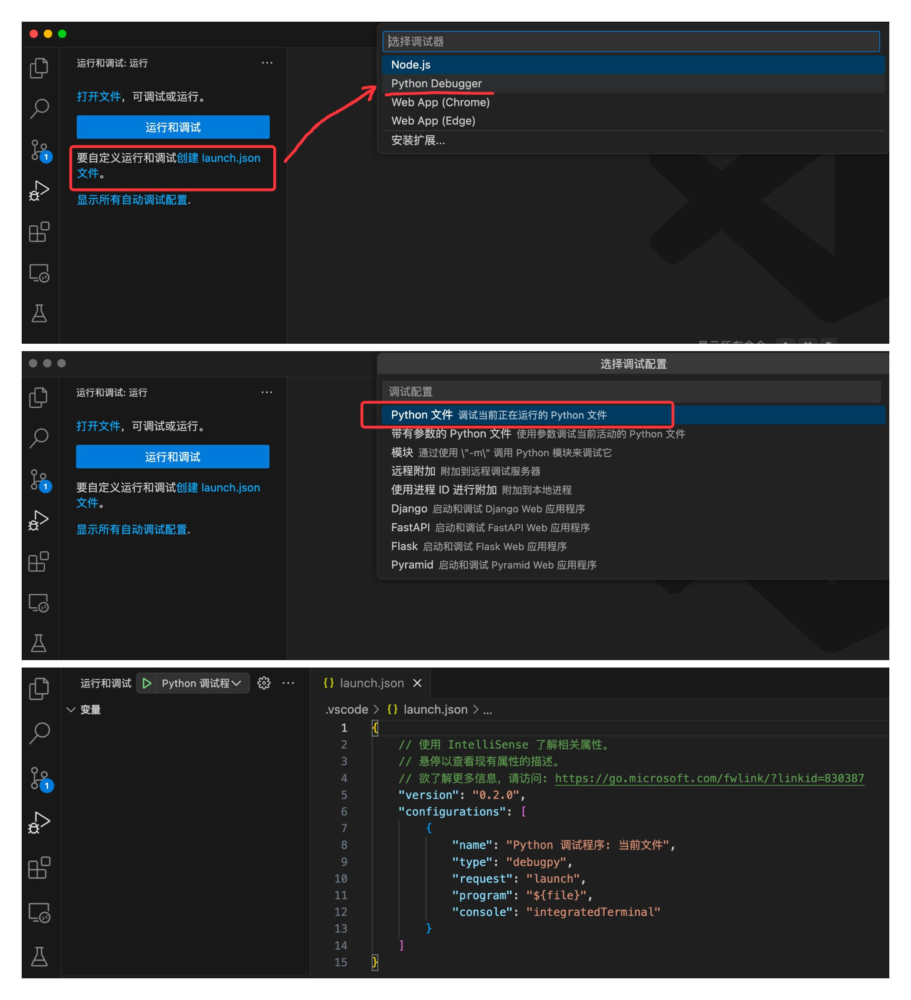
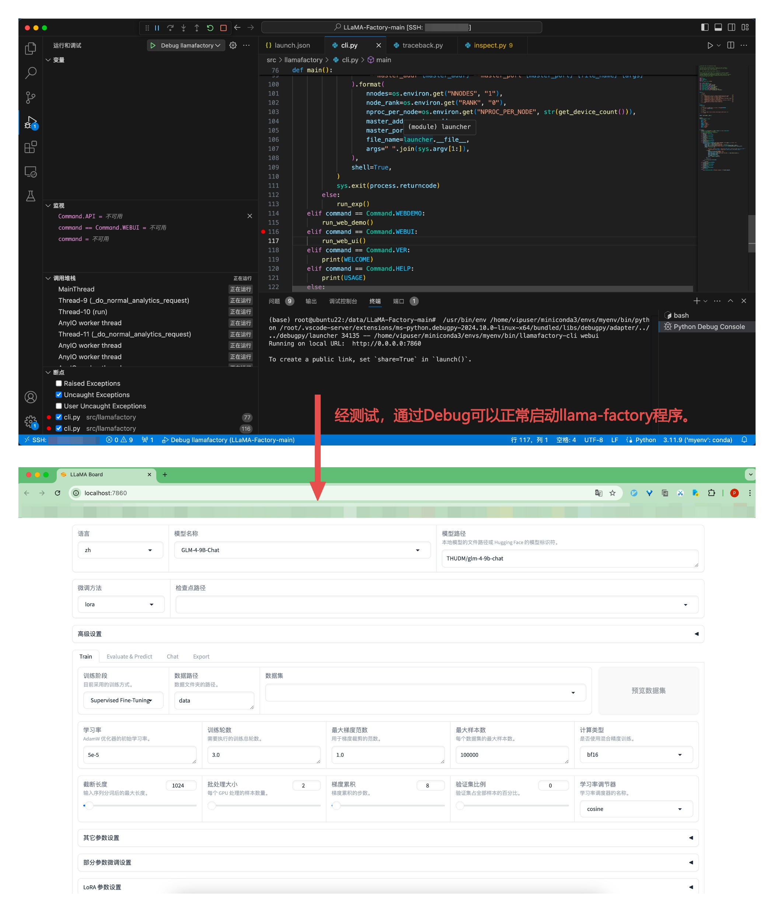

# Debug LLaMA-Factory

笔者习惯运行某个程序时，了解程序在不同步骤执行的操作。遂本章讲解如何针对 LLaMA-Factory 进行Debug，帮助大家更方便了解 LLaMA-Factory 底层设计。
- [Debug LLaMA-Factory](#debug-llama-factory)
  - [1. 创建 launch.json 文件:](#1-创建-launchjson-文件)
  - [2. 使用以下配置替换 launch.json 中的内容:](#2-使用以下配置替换-launchjson-中的内容)
  - [3. 测试效果:](#3-测试效果)


## 1. 创建 launch.json 文件:




## 2. 使用以下配置替换 launch.json 中的内容:

```json
{
    "version": "0.2.0",
    "configurations": [
        {
            "name": "Debug llamafactory",
            "type": "debugpy",
            "request": "launch",
            // 要调试的 Python 程序的路径，可通过终端输入 `which llamafactory-cli` 进行查看自己的程序路径。
            "program": "/home/vipuser/miniconda3/envs/myenv/bin/llamafactory-cli",
            // 启动程序时传递给它的命令行参数。在这里，传递了 "webui" 作为参数。
            "args": ["webui"],
            // 指定调试信息的输出位置。"integratedTerminal" 表示在 VS Code 的集成终端中显示输出信息。
            "console": "integratedTerminal",
            // 这个选项决定是否仅调试用户编写的代码。如果设置为 false，调试器会进入库文件代码中。
            "justMyCode": false
        }
    ]
}
```


## 3. 测试效果:

